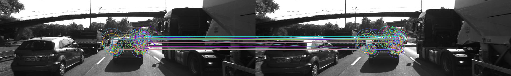

# SFND 2D Feature Tracking


The idea of the camera course is to build a collision detection system - that's the overall goal for the Final Project. As a preparation for this, you will now build the feature tracking part and test various detector / descriptor combinations to see which ones perform best. This mid-term project consists of four parts:

* First, you will focus on loading images, setting up data structures and putting everything into a ring buffer to optimize memory load. 
* Then, you will integrate several keypoint detectors such as HARRIS, FAST, BRISK and SIFT and compare them with regard to number of keypoints and speed. 
* In the next part, you will then focus on descriptor extraction and matching using brute force and also the FLANN approach we discussed in the previous lesson. 
* In the last part, once the code framework is complete, you will test the various algorithms in different combinations and compare them with regard to some performance measures. 

See the classroom instruction and code comments for more details on each of these parts. Once you are finished with this project, the keypoint matching part will be set up and you can proceed to the next lesson, where the focus is on integrating Lidar points and on object detection using deep-learning.

## Task MP.1 The data buffer
Implement circular vector.
The first approach is to erase the first element each time a new one over dataBufferSize
So finally:
```c_cpp
if (dataBuffer.size() >=dataBufferSize) // wait until at least two images have been processed
{
    dataBuffer.erase(dataBuffer.begin());
}
dataBuffer.push_back(frame);
```
Implemented in lines 111 to 114 of MidTermProjectCamera_Student.cpp

## Task MP.2 Keypoint Detectors

add the following keypoint detectors in file matching2D.cpp and enable string-based selection based on detectorType
 HARRIS, SHITOMASI, FAST, BRISK, ORB, AKAZE, FREAK, SIFT
 First we create an array of detector names
 string detectorTypes[]={"HARRIS", "SHITOMASI", "FAST", "BRISK", "ORB", "AKAZE", "FREAK", "SIFT"};
 A name is selected by selecting an array member by number from 0 of Harris to 6 of SIFT
 string detectorType = detectorTypes[4];
Since the name cant be mistyped there are only 3 options Shitomasi, Harris or modern.
```c_cpp
  if (detectorType.compare("SHITOMASI") == 0)
  {
      detKeypointsShiTomasi(keypoints, imgGray, bVis);
  }
  else if (detectorType.compare("HARRIS") == 0)
  {
      detKeypointsHarris(keypoints, imgGray, bVis);
  }
  else
  {
      detKeypointsModern(keypoints, imgGray,detectorType, bVis);
  }
```
Calls implemented in lines 135 to 146 of MidTermProject_Camera_Student.cpp
Methods implemented in lines 174 to 284 of matching2D_Student.cpp
## Task MP.3 Box Filtering 

only keep keypoints on the preceding vehicle
A rectangle is defined, so points that are inside of the rectanle are inserted.
```c_cpp
vector<cv::KeyPoint> keypointsInside;
for (auto kp : keypoints) {
  if (vehicleRect.contains(kp.pt)) keypointsInside.push_back(kp);
}
keypoints = keypointsInside;
```


Implemented in lines 163 to 167 of MidTermProjectCamera_Student.cpp

## Task MP.4 Descriptors

Add the following descriptors in file matching2D.cpp and enable string-based selection based on descriptorType
   BRISK, BRIEF, ORB, FREAK, AKAZE, SIFT

Like in MP.2 an array is used so cant be mistyped.
```c_cpp
        string descriptorTypes[]={"BRISK", "BRIEF", "ORB", "FREAK", "AKAZE", "SIFT"};
        string descriptorType = descriptorTypes[5];
```
The methods are implemented in matching2D_Student.cpp.
We still use OpenCV build-in descriptors (BRIEF, ORB, FREAK, AKAZE and SIFT) class with default parameters to uniquely identify keypoints. Similar to step 2, we log the descriptor extraction time for performance evaluation.

After all the implementations, I have had some problems with the AKAZE descriptor, since I have seen that it seems that only can be used with the AKAZE key point detector.
Calls implemented in lines 198 to 206 of MidTermProject_Camera_Student.cpp
This has been changed to generate the data table. You can select descriptor in line 201 when in line 20 createTableDetectors is not defined #define createTableDetectors if its defined, it will be automatically selected. 
Methods implemented in lines 86 to 130 of matching2D_Student.cpp

## Task MP.5 add FLANN matching 
At the beginning was only one line in file matching2D.cpp from open cv docs
```c_cpp
matcher = cv::DescriptorMatcher::create(cv::DescriptorMatcher::FLANNBASED);
```
User can choose which matching method to use: Brute-force matcher(MAT_BF) or FLANN matcher(MAT_FLANN). 

But after trying with every combination there were problems with SIFT so we have to convert our image to CV_32F.
Implemented in lines 39 to 51 of matching2D_Student.cpp.

## TASK MP.6 add KNN match selection 
and perform descriptor distance ratio filtering with t=0.8 in file matching2D.cpp
Nearest neighbor or best match is already implemented, so K nearest neighbors (default k=2) are implemented. 
For KNN matching, we filter matches using descriptor distance ratio test to remove some outliers. 
Implemented in matching_2d_Student.cpp lines 67 to 77.

## Task MP.7
Your seventh task is to count the number of keypoints on the preceding vehicle for all 10 images and take note of the distribution of their neighborhood size. Do this for all the detectors you have implemented.

At the beginning it was a manual task, but as soon as I change something I had to begin again I tried to make it automatic.
You can define in line 20 of MidTermProject_Camera_Student.cpp 
#define createTableDetectors 

Then, if you disable bVis, you can generate all the combinations and generate thw following tables in the build folder.

| Detectors | 01   | 02   | 03   | 04   | 05   | 06   | 07   | 08   | 09   | 10   |Total |
| :-------: | :--: | :--: | :--: | :--: | :--: | :--: | :--: | :--: | :--: | :--: | :--: |
|HARRIS|115|98|113|121|160|383|85|210|171|281|1737|
|SHITOMASI|1370|1301|1361|1358|1333|1284|1322|1366|1389|1339|13423|
|FAST|1824|1832|1810|1817|1793|1796|1788|1695|1749|1770|17874|
|BRISK|2757|2777|2741|2735|2757|2695|2715|2628|2639|2672|27116|
|ORB|500|500|500|500|500|500|500|500|500|500|5000|
|AKAZE|1351|1327|1311|1351|1360|1347|1363|1331|1357|1331|13429|
|SIFT|1438|1371|1380|1335|1305|1370|1396|1382|1463|1422|13862 |


## Task MP.8
Your eighth task is to count the number of matched keypoints for all 10 images using all possible combinations of detectors and descriptors. In the matching step, use the BF approach with the descriptor distance ratio set to 0.8.

| Det/Desc | 01-02   | 02-03   | 03-04   | 04-05   | 05-06   | 06-07   | 07-08   | 08-09   | 09-10| 
| :-------: | :--: | :--: | :--: | :--: | :--: | :--: | :--: | :--: | :--: |
|HARRIS/BRISK|12|10|14|15|16|16|15|23|21|
|HARRIS/BRIEF|14|11|15|20|24|26|16|24|23|
|HARRIS/FREAK|13|13|15|15|17|20|12|21|18|
|HARRIS/SIFT|14|11|16|19|22|22|13|24|22|
|HARRIS/ORB|12|12|15|18|24|20|15|24|22|
|SHITOMASI/BRISK|95|88|80|90|82|79|85|86|82|
|SHITOMASI/BRIEF|115|111|104|101|102|102|100|109|100|
|SHITOMASI/FREAK|86|90|86|88|86|80|81|86|85|
|SHITOMASI/SIFT|112|109|104|103|99|101|96|106|97|
|SHITOMASI/ORB|106|102|99|102|103|97|98|104|97|
|FAST/BRISK|97|104|101|98|85|107|107|100|100|
|FAST/BRIEF|119|130|118|126|108|123|131|125|119|
|FAST/FREAK|98|99|91|98|85|99|102|101|105|
|FAST/SIFT|118|123|110|119|114|119|123|117|103|
|FAST/ORB|118|123|112|126|106|122|122|123|119|
|BRISK/BRISK|171|176|157|176|174|188|173|171|184|
|BRISK/BRIEF|178|205|185|179|183|195|207|189|183|
|BRISK/FREAK|160|177|155|173|161|183|169|178|168|
|BRISK/SIFT|182|193|169|183|171|195|194|176|183|
|BRISK/ORB|162|175|158|167|160|182|167|171|172|
|ORB/BRISK|73|74|79|85|79|92|90|88|91|
|ORB/BRIEF|49|43|45|59|53|78|68|84|66|
|ORB/FREAK|42|36|44|47|44|51|52|48|56|
|ORB/SIFT|67|79|78|79|82|95|95|94|94|
|ORB/ORB|67|70|72|84|91|101|92|93|93|
|AKAZE/BRISK|137|125|129|129|131|132|142|146|144|
|AKAZE/BRIEF|141|134|131|130|134|146|150|148|152|
|AKAZE/FREAK|126|129|127|121|122|133|144|147|138|
|AKAZE/SIFT|134|134|130|136|137|147|147|154|151|
|AKAZE/ORB|131|129|127|117|130|131|137|135|145|
|AKAZE/AKAZE|138|138|133|127|129|146|147|151|150|
|SIFT/BRISK|64|66|62|66|59|64|64|67|80|
|SIFT/BRIEF|86|78|76|85|69|74|76|70|88|
|SIFT/FREAK|65|72|64|66|59|59|64|65|79|
|SIFT/SIFT|82|81|85|93|90|81|82|102|104|


* KAZE/AKAZE descriptors will only work with KAZE/AKAZE keypoints.
* SIFT/ORB Segmentation Fault

## Task MP.9
Your ninth task is to log the time it takes for keypoint detection and descriptor extraction. The results must be entered into a spreadsheet and based on this information you will then suggest the TOP3 detector / descriptor combinations as the best choice for our purpose of detecting keypoints on vehicles. Finally, in a short text, please justify your recommendation based on your observations and on the data you collected.
#### Efficiency (matches/ms)

| Det/Desc |Total Matching/Total Time |Ratio |
| :-------: | :--: | :--: | 
|HARRIS/BRISK|142 / 3309.792572 ms|0.042903 matches/ms|
|HARRIS/BRIEF|173 / 205.572772 ms|0.841551 matches/ms|
|HARRIS/FREAK|144 / 505.838594 ms|0.284676 matches/ms|
|HARRIS/SIFT|163 / 320.908251 ms|0.507933 matches/ms|
|HARRIS/ORB|162 / 166.938886 ms|0.970415 matches/ms|
|SHITOMASI/BRISK|767 / 3165.183603 ms|0.242324 matches/ms|
|SHITOMASI/BRIEF|944 / 116.832761 ms|8.079925 matches/ms|
|SHITOMASI/FREAK|768 / 500.577007 ms|1.534229 matches/ms|
|SHITOMASI/SIFT|927 / 279.307198 ms|3.318926 matches/ms|
|SHITOMASI/ORB|908 / 120.232969 ms|7.552005 matches/ms|
|FAST/BRISK|899 / 3058.198621 ms|0.293964 matches/ms|
|FAST/BRIEF|1099 / 22.960734 ms|47.864324 matches/ms|
|FAST/FREAK|878 / 380.201239 ms|2.309303 matches/ms|
|FAST/SIFT|1046 / 230.142660 ms|4.545007 matches/ms|
|FAST/ORB|1071 / 26.863188 ms|39.868686 matches/ms|
|BRISK/BRISK|1570 / 6490.297011 ms|0.241900 matches/ms|
|BRISK/BRIEF|1704 / 3469.444028 ms|0.491145 matches/ms|
|BRISK/FREAK|1524 / 3839.157322 ms|0.396962 matches/ms|
|BRISK/SIFT|1646 / 3863.643113 ms|0.426023 matches/ms|
|BRISK/ORB|1514 / 3465.673206 ms|0.436856 matches/ms|
|ORB/BRISK|751 / 3118.178420 ms|0.240846 matches/ms|
|ORB/BRIEF|545 / 81.842528 ms|6.659130 matches/ms|
|ORB/FREAK|420 / 432.941455 ms|0.970108 matches/ms|
|ORB/SIFT|763 / 522.351990 ms|1.460701 matches/ms|
|ORB/ORB|763 / 116.807599 ms|6.532109 matches/ms|
|AKAZE/BRISK|1215 / 3790.106610 ms|0.320571 matches/ms|
|AKAZE/BRIEF|1266 / 769.206795 ms|1.645851 matches/ms|
|AKAZE/FREAK|1187 / 1150.682412 ms|1.031562 matches/ms|
|AKAZE/SIFT|1270 / 947.393986 ms|1.340519 matches/ms|
|AKAZE/ORB|1182 / 764.551184 ms|1.546005 matches/ms|
|AKAZE/AKAZE|1259 / 1371.634908 ms|0.917883 matches/ms|
|SIFT/BRISK|592 / 4280.008860 ms|0.138317 matches/ms|
|SIFT/BRIEF|702 / 1213.750160 ms|0.578373 matches/ms|
|SIFT/FREAK|593 / 1615.867302 ms|0.366986 matches/ms|
|SIFT/SIFT|800 / 1672.714524 ms|0.478265 matches/ms|

#### TOP3 detector / descriptor combinations

1. FAST + BRIEF
2. FAST + ORB
3. SHITOMASI + BRIEF
  
For our purposes of calculating the time to a collision, I think the fastest is the best combination. For another kind of application where tolerance must be better and we don't have time constraints maybe another combination will work better.


* cmake >= 2.8
  * All OSes: [click here for installation instructions](https://cmake.org/install/)
* make >= 4.1 (Linux, Mac), 3.81 (Windows)
  * Linux: make is installed by default on most Linux distros
  * Mac: [install Xcode command line tools to get make](https://developer.apple.com/xcode/features/)
  * Windows: [Click here for installation instructions](http://gnuwin32.sourceforge.net/packages/make.htm)
* OpenCV >= 4.1
  * This must be compiled from source using the `-D OPENCV_ENABLE_NONFREE=ON` cmake flag for testing the SIFT and SURF detectors.
  * The OpenCV 4.1.0 source code can be found [here](https://github.com/opencv/opencv/tree/4.1.0)
* gcc/g++ >= 5.4
  * Linux: gcc / g++ is installed by default on most Linux distros
  * Mac: same deal as make - [install Xcode command line tools](https://developer.apple.com/xcode/features/)
  * Windows: recommend using [MinGW](http://www.mingw.org/)

## Basic Build Instructions

1. Clone this repo.
2. Make a build directory in the top level directory: `mkdir build && cd build`
3. Compile: `cmake .. && make`
4. Run it: `./2D_feature_tracking`.
